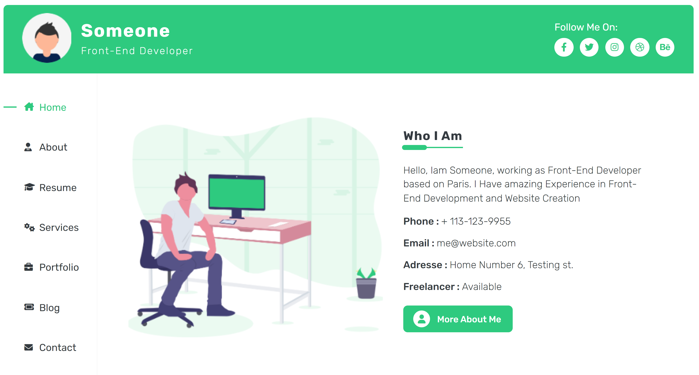

# Elzero Frontend Challenge - Advanced User Card

## Welcome 👋

Hello and welcome to my solution for the **Advanced User Card** frontend challenge from [Elzero Web School](https://elzero.org/category/challenges/front-end-challenges/).

## The Challenge

The challenge was to build a card with user information. The design for the challenge was provided in the form of an image.

## Requirements

- Create the required design in the exercise.
- Ensure that the same colors are used in the background and in all elements on the page.
- You can use any image you like in the exercise.
- You can use any preferred Icons library.

## Challenges

- Use only Flex or Grid to create the design.

## My Solution

- **Demo** : [Advanced User Card](https://mouatezbenariba.github.io/Elzero-Frontend-Challenges/advanced-user-card/)
- **Codepen** : [Advanced User Card](https://codepen.io/mouatezbenariba/pen/jOKajEB)

## Technologies Used

- HTML5
- CSS3
- Flexbox
- Responsive Design
- Mobile-first workflow

## Made with ❤ by:

- Website - [Elmouatez Billah Benariba](https://www.mouatezbenariba.me/)
- Linkedin - [Elmouatez Billah Benariba](https://www.linkedin.com/in/mouatezbenariba/)
- Twitter - [@mouatezbenariba](https://twitter.com/mouatezbenariba)
- Instagram - [@mouatez.benariba](https://www.instagram.com/mouatez.benariba/)

## Acknowledgments

- I would like to express my special thanks of gratitude to eng [Osama Mohamed](https://github.com/OsamaElzero).

## Contribution

Thank you for taking the time to review my solution for the Advanced User Card challenge from Elzero Web School Frontend Challenges. If you have any feedback or suggestions, I would love to hear them!
