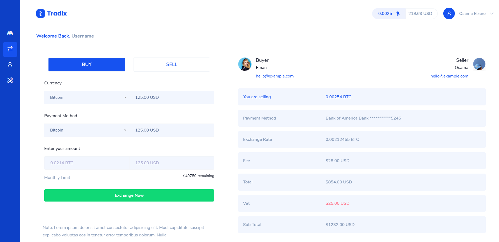

# Elzero Frontend Challenge - Bitcoin Dashboard

## Welcome 👋

Hello and welcome to my solution for the Simple Bitcoin Dashboard frontend challenge from [Elzero Web School](https://elzero.org/category/challenges/front-end-challenges/).

## The Challenge

- Create a Bitcoin Dashboard.

## Requirements

- Create the same background and colors for the elements.
- You can use Font Awesome library to add Icons or any preferred library.
- Use any images you want.

## Challenges

- Do not use Float at all.

## Technologies Used

- HTML5
- CSS3
- Flexbox
- Responsive Design

## My Solution

- Demo : [Simple Bitcoin Dashboard](https://mouatezbenariba.github.io/Elzero-Frontend-Challenges/bitcoin-dashboard/)
- Codepen : [Simple Bitcoin Dashboard](https://codepen.io/mouatezbenariba/pen/vYdXaRw)

## Conclusion

Thank you for taking the time to review my solution for the Simple Bitcoin Dashboard challenge from Elzero Web School Frontend Challenges. If you have any feedback or suggestions, I would love to hear them!
