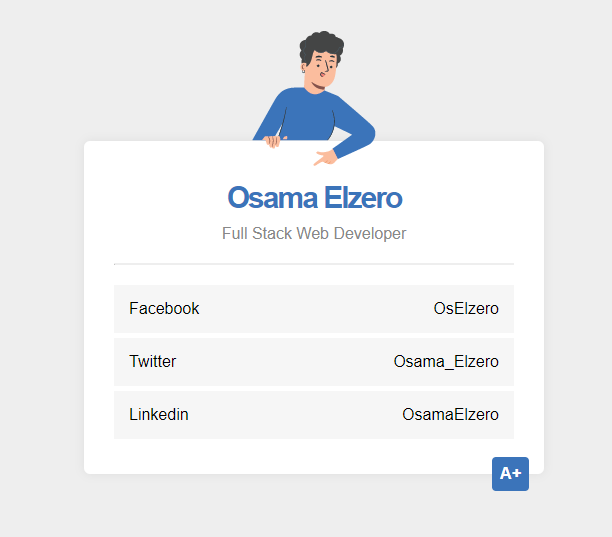

# Elzero Frontend Challenge - Card with Transparent Image

## Welcome 👋

Hello and welcome to my solution for the **Card With Transparent Image** frontend challenge from [Elzero Web School](https://elzero.org/category/challenges/front-end-challenges/).

## The Challenge

The challenge was to build a social media card. The design for the challenge was provided in the form of an image.

## Requirements

- Create the shape as it is.
- You can use the same image provided here.

## Challenges

- Use Flex or Grid to distribute the elements.

## Technologies Used

- HTML5
- CSS3

## My Solution

- Demo : [Card With Transparent Image](https://mouatezbenariba.github.io/Elzero-Frontend-Challenges/card-with-transparent-image/)
- Codepen : [Card With Transparent Image](https://codepen.io/mouatezbenariba/pen/xxpzbKG)

## Made with ❤ by:

- Website - [Elmouatez Billah Benariba](https://www.mouatezbenariba.me/)
- Linkedin - [Elmouatez Billah Benariba](https://www.linkedin.com/in/mouatezbenariba/)
- Twitter - [@mouatezbenariba](https://twitter.com/mouatezbenariba)
- Instagram - [@mouatez.benariba](https://www.instagram.com/mouatez.benariba/)

## Acknowledgments

- I would like to express my special thanks of gratitude to eng [Osama Mohamed](https://github.com/OsamaElzero).

## Contribution

Thank you for taking the time to review my solution for the Card With Transparent Image challenge from Elzero Web School Frontend Challenges. If you have any feedback or suggestions, I would love to hear them!
