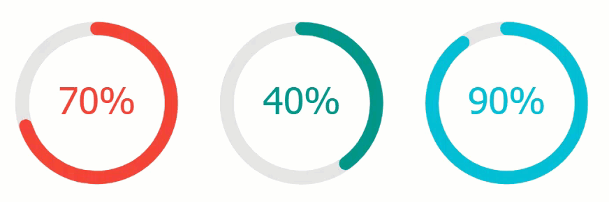

# Elzero Frontend Challenge - Circle Animated Progress

## Welcome 👋

Hello and welcome to my solution for the **Circle Animated Progress** frontend challenge from [Elzero Web School](https://elzero.org/category/challenges/front-end-challenges/).

## The Challenge

The challenge was to build a three circle animated progress bars. The design for the challenge was provided in the form of an image.

## Requirements

- Replicate the colors used in the image
- Use any aspect ratio you prefer
- Use Font Awesome or any other icon library you like

## Challenges

- Do not use float at all.

## Technologies Used

- HTML5
- CSS3

## My Solution

- Demo : [Circle Animated Progress](https://mouatezbenariba.github.io/Elzero-Frontend-Challenges/circle-and-boxes/)
- Codepen : [Circle Animated Progress](https://codepen.io/mouatezbenariba/pen/KKRzeZj)

## Made with ❤ by:

- Website - [Elmouatez Billah Benariba](https://www.mouatezbenariba.me/)
- Linkedin - [Elmouatez Billah Benariba](https://www.linkedin.com/in/mouatezbenariba/)
- Twitter - [@mouatezbenariba](https://twitter.com/mouatezbenariba)
- Instagram - [@mouatez.benariba](https://www.instagram.com/mouatez.benariba/)

## Acknowledgments

- I would like to express my special thanks of gratitude to eng [Osama Mohamed](https://github.com/OsamaElzero).

## Contribution

Thank you for taking the time to review my solution for the Circle Animated Progress challenge from Elzero Web School Frontend Challenges. If you have any feedback or suggestions, I would love to hear them!
