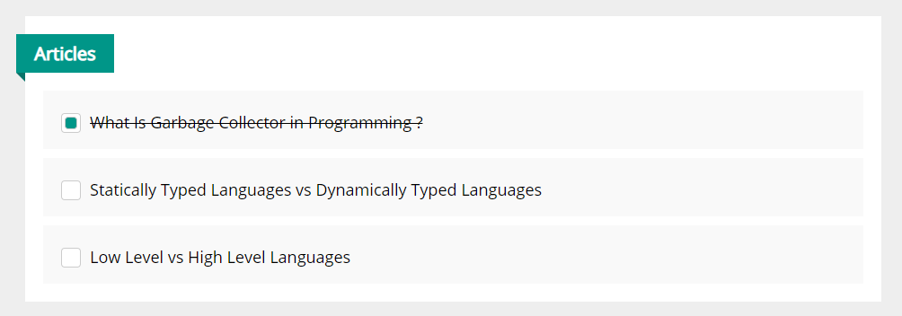

# Elzero Frontend Challenge - Custom Checkbox Todo List

## Welcome 👋

Hello and welcome to my solution for the **Custom Checkbox Todo List** frontend challenge from [Elzero Web School](https://elzero.org/category/challenges/front-end-challenges/).

## The Challenge

The challenge was to build a simple custom checkbox todo list. The design for the challenge was provided in the form of an image.

## Requirements

- The task is to create the same design with the same colors.

## Challenges

- Do not use any library to create the custom checkbox or the ribbon.

## Technologies Used

- HTML5
- CSS3

## My Solution

- Demo : [Custom Checkbox Todo List](https://mouatezbenariba.github.io/Elzero-Frontend-Challenges/custom-checkbox-todo-list/)
- Codepen : [Custom Checkbox Todo List](https://codepen.io/mouatezbenariba/pen/jOZrMWp)

## Made with ❤ by:

- Website - [Elmouatez Billah Benariba](https://www.mouatezbenariba.me/)
- Linkedin - [Elmouatez Billah Benariba](https://www.linkedin.com/in/mouatezbenariba/)
- Twitter - [@mouatezbenariba](https://twitter.com/mouatezbenariba)
- Instagram - [@mouatez.benariba](https://www.instagram.com/mouatez.benariba/)

## Acknowledgments

- I would like to express my special thanks of gratitude to eng [Osama Mohamed](https://github.com/OsamaElzero).

## Contribution

Thank you for taking the time to review my solution for the Custom Checkbox Todo List challenge from Elzero Web School Frontend Challenges. If you have any feedback or suggestions, I would love to hear them!
