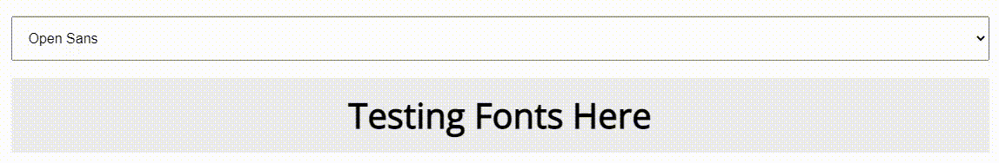

# Elzero Frontend Challenge - Font Changer

## Welcome 👋

Hello and welcome to my solution for the **Font Changer** frontend challenge from [Elzero Web School](https://elzero.org/category/challenges/front-end-challenges/).

## The Challenge

The challenge was to build a simple Font Changer. The design for the challenge was provided in the form of an image.

## Requirements

- Create a Select Box containing a collection of Fonts for users to choose from.

- When any Font is selected, it should be applied directly to the page, as shown in the image.

- The task should be implemented in a dynamic manner, so that any Font added to the Select Box is automatically applied.

## Technologies Used

- HTML5
- CSS3
- JavaScript

## My Solution

- Demo : [Font Changer](https://mouatezbenariba.github.io/Elzero-Frontend-Challenges/font-changer/)
- Codepen : [Font Changer](https://codepen.io/mouatezbenariba/pen/JjeRVmB)

## Blog post

Explore my blog post where I provide a step-by-step breakdown of how I tackled Show/Hide Paragraph Elzero Frontend Challenge.

- Personal Blog: [Create a simple Font Changer - Elzero Frontend Challenges](https://blog.mouatezbenariba.me/blog/en/create-a-simple-font-changer-elzero-frontend-challenges/)
- Hashnode: [Create a simple Font Changer - Elzero Frontend Challenges](https://hashnode.mouatezbenariba.me/create-a-simple-font-changer-elzero-frontend-challenges)
- Dev.to: [Create a simple Font Changer - Elzero Frontend Challenges](https://dev.to/mouatezbenariba/create-a-simple-font-changer-elzero-frontend-challenges-mmi)

## Made with ❤ by:

- Website - [Elmouatez Billah Benariba](https://www.mouatezbenariba.me/)
- Linkedin - [Elmouatez Billah Benariba](https://www.linkedin.com/in/mouatezbenariba/)
- Twitter - [@mouatezbenariba](https://twitter.com/mouatezbenariba)
- Instagram - [@mouatez.benariba](https://www.instagram.com/mouatez.benariba/)

## Acknowledgments

- I would like to express my special thanks of gratitude to eng [Osama Mohamed](https://github.com/OsamaElzero).

## Contribution

Thank you for taking the time to review my solution for the Font Changer challenge from Elzero Web School Frontend Challenges. If you have any feedback or suggestions, I would love to hear them!
