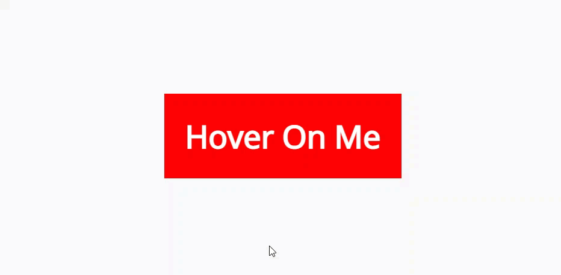

# Elzero Frontend Challenge - How to Show Tooltip

## Welcome 👋

Hello and welcome to my solution for the **Hover To Show Tooltip** frontend challenge from [Elzero Web School](https://elzero.org/category/challenges/front-end-challenges/).

## The Challenge

The challenge was to build a tooltip that shows when hovering on a button (or an element). The design for the challenge was provided in the form of an image.

## Requirements

- Create the same shape with the ability to add any data you want.
- You must use the same colors.

## Challenges

- You must use only the HTML + CSS languages.
- You must create only one Span element on the entire page to execute the idea.
- The Tooltip should appear smoothly as in the example.

## Technologies Used

- HTML5
- CSS3

## My Solution

- Demo : [Hover To Show Tooltip](https://mouatezbenariba.github.io/Elzero-Frontend-Challenges/hover-to-show-tooltip/)
- Codepen : [Hover To Show Tooltip](https://codepen.io/mouatezbenariba/pen/KKZJOEN)

## Made with ❤ by:

- Website - [Elmouatez Billah Benariba](https://www.mouatezbenariba.me/)
- Linkedin - [Elmouatez Billah Benariba](https://www.linkedin.com/in/mouatezbenariba/)
- Twitter - [@mouatezbenariba](https://twitter.com/mouatezbenariba)
- Instagram - [@mouatez.benariba](https://www.instagram.com/mouatez.benariba/)

## Acknowledgments

- I would like to express my special thanks of gratitude to eng [Osama Mohamed](https://github.com/OsamaElzero).

## Contribution

Thank you for taking the time to review my solution for the Hover To Show Tooltip challenge from Elzero Web School Frontend Challenges. If you have any feedback or suggestions, I would love to hear them!
