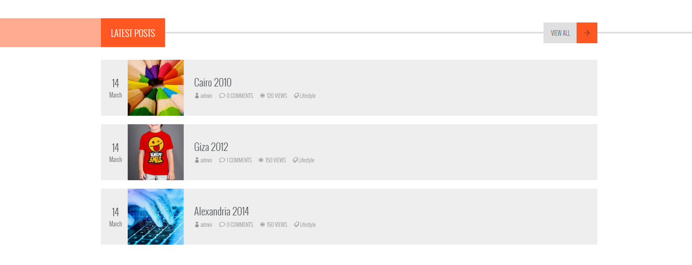

# Elzero Frontend Challenge - Latest Posts with Head

## Welcome 👋

Hello and welcome to my solution for the **Latest Posts With Head** frontend challenge from [Elzero Web School](https://elzero.org/category/challenges/front-end-challenges/).

## The Challenge

The challenge was to build a lastest posts with header section. The design for the challenge was provided in the form of an image.

## Requirements

- Create the same background and colors for the elements.
- You can use any image, it doesn't have to be the same as the example.
- You can use the Font Awesome library for icons, or any other library you like.

## Technologies Used

- HTML5
- CSS3

## My Solution

- Demo : [Latest Posts With Head](https://mouatezbenariba.github.io/Elzero-Frontend-Challenges/latest-posts-with-head/)
- Codepen : [Latest Posts With Head](https://codepen.io/mouatezbenariba/pen/abYbwZa)

## Made with ❤ by:

- Website - [Elmouatez Billah Benariba](https://www.mouatezbenariba.me/)
- Linkedin - [Elmouatez Billah Benariba](https://www.linkedin.com/in/mouatezbenariba/)
- Twitter - [@mouatezbenariba](https://twitter.com/mouatezbenariba)
- Instagram - [@mouatez.benariba](https://www.instagram.com/mouatez.benariba/)

## Acknowledgments

- I would like to express my special thanks of gratitude to eng [Osama Mohamed](https://github.com/OsamaElzero).

## Contribution

Thank you for taking the time to review my solution for the Latest Posts With Head challenge from Elzero Web School Frontend Challenges. If you have any feedback or suggestions, I would love to hear them!
