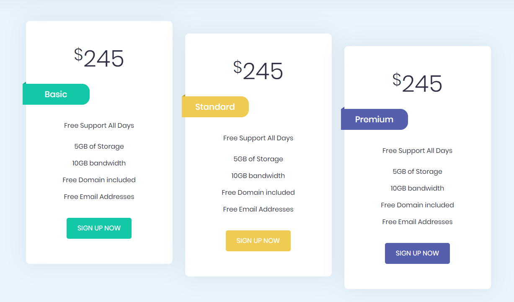

# Elzero Frontend Challenge - Pricing Plans with Ribbons

## Welcome 👋

Hello and welcome to my solution for the **Pricing Plans With Ribbons** frontend challenge from [Elzero Web School](https://elzero.org/category/challenges/front-end-challenges/).

## The Challenge

The challenge was to build a three pricing plans with ribbons. The design for the challenge was provided in the form of an image.

## Requirements

- Create the same background and colors for the elements.
- Use Flex Box to distribute the elements.

## Technologies Used

- HTML5
- CSS3

## My Solution

- Demo : [Pricing Plans With Ribbons](https://mouatezbenariba.github.io/Elzero-Frontend-Challenges/pricing-plans-with-ribbons/)
- Codepen : [Pricing Plans With Ribbons](https://codepen.io/mouatezbenariba/pen/qBJYvYK)

## Made with ❤ by:

- Website - [Elmouatez Billah Benariba](https://www.mouatezbenariba.me/)
- Linkedin - [Elmouatez Billah Benariba](https://www.linkedin.com/in/mouatezbenariba/)
- Twitter - [@mouatezbenariba](https://twitter.com/mouatezbenariba)
- Instagram - [@mouatez.benariba](https://www.instagram.com/mouatez.benariba/)

## Acknowledgments

- I would like to express my special thanks of gratitude to eng [Osama Mohamed](https://github.com/OsamaElzero).

## Contribution

Thank you for taking the time to review my solution for the Pricing Plans With Ribbons challenge from Elzero Web School Frontend Challenges. If you have any feedback or suggestions, I would love to hear them!
