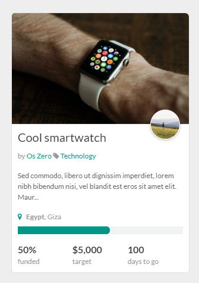

# Elzero Frontend Challenge - Product Box with Progress

## Welcome 👋

Hello and welcome to my solution for the **Product Box With Progress** frontend challenge from [Elzero Web School](https://elzero.org/category/challenges/front-end-challenges/).

## The Challenge

The challenge was to build a product box with progress. The design for the challenge was provided in the form of an image.

## Requirements

- Create the same background and colors for the elements.
- You can choose any images you like, it's not necessary to use the same images.
- You can use the Font Awesome library to add icons, or any library you prefer.

## Technologies Used

- HTML5
- CSS3

## My Solution

- Demo : [Product Box With Progress](https://mouatezbenariba.github.io/Elzero-Frontend-Challenges/product-box-with-progress/)
- Codepen : [Product Box With Progress](https://codepen.io/mouatezbenariba/pen/eYVKdxy)

## Made with ❤ by:

- Website - [Elmouatez Billah Benariba](https://www.mouatezbenariba.me/)
- Linkedin - [Elmouatez Billah Benariba](https://www.linkedin.com/in/mouatezbenariba/)
- Twitter - [@mouatezbenariba](https://twitter.com/mouatezbenariba)
- Instagram - [@mouatez.benariba](https://www.instagram.com/mouatez.benariba/)

## Acknowledgments

- I would like to express my special thanks of gratitude to eng [Osama Mohamed](https://github.com/OsamaElzero).

## Contribution

Thank you for taking the time to review my solution for the Product Box With Progress challenge from Elzero Web School Frontend Challenges. If you have any feedback or suggestions, I would love to hear them!
