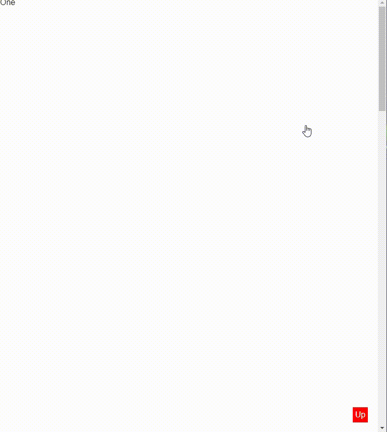

# Elzero Frontend Challenge - Scroll to Top Button

## Welcome 👋

Hello and welcome to my solution for the **Scroll To Top Button** frontend challenge from [Elzero Web School](https://elzero.org/category/challenges/front-end-challenges/).

## The Challenge

The challenge was to build a simple scroll to top button. The design for the challenge was provided in the form of an image.

## Requirements

- Create a long page with a Scroll To Top button in any suitable design for you.
- When the button is clicked, it smoothly scrolls up to the top of the page.

## Challenges

-Do not use JavaScript at all.

## Technologies Used

- HTML5
- CSS3

## My Solution

- Demo : [Scroll To Top Button](https://mouatezbenariba.github.io/Elzero-Frontend-Challenges/scroll-to-top-button/)
- Codepen : [Scroll To Top Button](https://codepen.io/mouatezbenariba/pen/bGajPQg)

## Made with ❤ by:

- Website - [Elmouatez Billah Benariba](https://www.mouatezbenariba.me/)
- Linkedin - [Elmouatez Billah Benariba](https://www.linkedin.com/in/mouatezbenariba/)
- Twitter - [@mouatezbenariba](https://twitter.com/mouatezbenariba)
- Instagram - [@mouatez.benariba](https://www.instagram.com/mouatez.benariba/)

## Acknowledgments

- I would like to express my special thanks of gratitude to eng [Osama Mohamed](https://github.com/OsamaElzero).

## Contribution

Thank you for taking the time to review my solution for the Scroll To Top Button challenge from Elzero Web School Frontend Challenges. If you have any feedback or suggestions, I would love to hear them!
