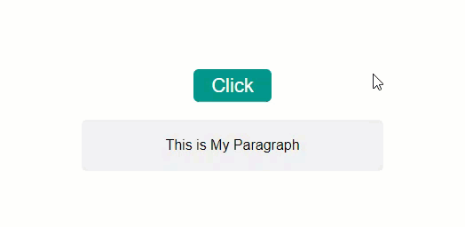

# Elzero Frontend Challenge - Show / Hide Paragraph

## Welcome 👋

Hello and welcome to my solution for the **Show / Hide Paragraph** frontend challenge from [Elzero Web School](https://elzero.org/category/challenges/front-end-challenges/).

## The Challenge

The challenge was to build a button that shows and hides a paragraph. The design for the challenge was provided in the form of an image.

## Requirements

- Upon clicking the button, the text paragraph should disappear, and upon clicking again, it should reappear.

## Challenges

- Using the getComputedStyle property.

## Technologies Used

- HTML5
- CSS3

## My Solution

- Demo : [Show / Hide Paragraph](https://mouatezbenariba.github.io/Elzero-Frontend-Challenges/show-hide-paragraph/)
- Codepen : [Show / Hide Paragraph](https://codepen.io/mouatezbenariba/pen/poxBvga/)

## Made with ❤ by:

- Website - [Elmouatez Billah Benariba](https://www.mouatezbenariba.me/)
- Linkedin - [Elmouatez Billah Benariba](https://www.linkedin.com/in/mouatezbenariba/)
- Twitter - [@mouatezbenariba](https://twitter.com/mouatezbenariba)
- Instagram - [@mouatez.benariba](https://www.instagram.com/mouatez.benariba/)

## Acknowledgments

- I would like to express my special thanks of gratitude to eng [Osama Mohamed](https://github.com/OsamaElzero).

## Contribution

Thank you for taking the time to review my solution for the Show / Hide Paragraph challenge from Elzero Web School Frontend Challenges. If you have any feedback or suggestions, I would love to hear them!
