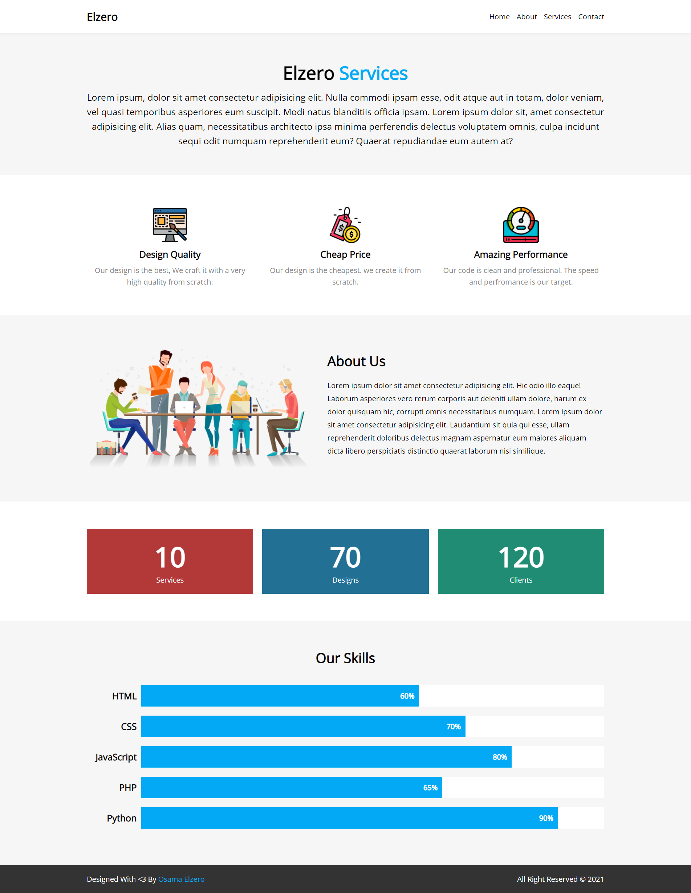

# Elzero Frontend Challenge - Team Skills and Stats

## Welcome 👋

Hello and welcome to my solution for the **Team Skills and Stats** frontend challenge from [Elzero Web School](https://elzero.org/category/challenges/front-end-challenges/).

## The Challenge

The challenge was to build an Elzero team services landing page. The design for the challenge was provided in the form of an image.

## Requirements

- Create the same design with the ability to add any data you want.
- You can add any images you like.

## Challenges

- Use Flexbox to distribute all elements.
- Do not use Float or Inline-Block at all.
- Use CSS Variables in dynamic things like the main color and margins inside sections.
- Use the Open Sans font from Google fonts in both - Regular and Light weights.
- Create a framework that includes classes that are used frequently, such as Flex.
- Use Semantic Elements in building the page.

## Technologies Used

- HTML5
- CSS3

## My Solution

- Demo : [Team Skills and Stats](https://mouatezbenariba.github.io/Elzero-Frontend-Challenges/team-skills-and-stats/)
- Codepen : [Team Skills and Stats](https://codepen.io/mouatezbenariba/pen/yLvBBGN)

## Made with ❤ by:

- Website - [Elmouatez Billah Benariba](https://www.mouatezbenariba.me/)
- Linkedin - [Elmouatez Billah Benariba](https://www.linkedin.com/in/mouatezbenariba/)
- Twitter - [@mouatezbenariba](https://twitter.com/mouatezbenariba)
- Instagram - [@mouatez.benariba](https://www.instagram.com/mouatez.benariba/)

## Acknowledgments

- I would like to express my special thanks of gratitude to eng [Osama Mohamed](https://github.com/OsamaElzero).

## Contribution

Thank you for taking the time to review my solution for the Team Skills and Stats challenge from Elzero Web School Frontend Challenges. If you have any feedback or suggestions, I would love to hear them!
